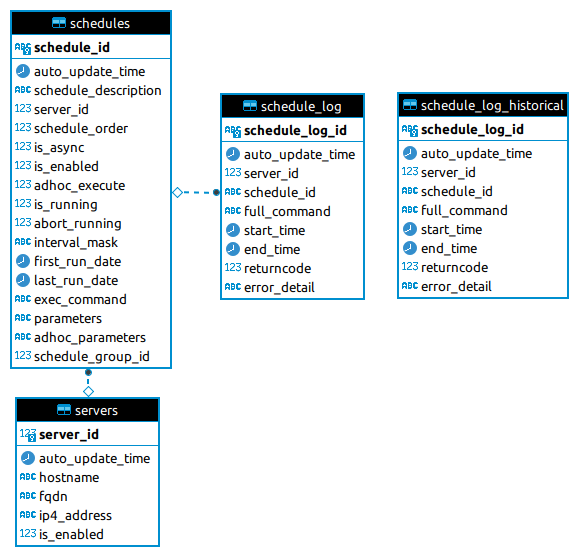

# Cicada scheduler

*Centralized Distributed Scheduler*

- [Overview](#overview)
    - [Advantages over using only CRON](#advantages-over-using-only-cron)
    - [Execution flow diagram](#execution-flow-diagram)
- [Setup Central database](#setup-central-database)
    - [Database ERD](#database-erd)
- [Setup Node](#setup-node)
- [Administration](#administration)
    - [cli help](#cli-help)
    - [(Re)register a server to Cicada](#(re)register-a-server-to-cicada)
    - [Add or Update a new schedule](#add-or-update-a-new-schedule)
    - [Launch a schedule once](#launch-a-schedule-once)
    - [Launch a schedule once](#launch-a-schedule-once)
    - [Abort a running schedule](#abort-a-running-schedule)
## Overview

- Cicada is best understood as a lightweight management layer between linux CRON and the end executables
- It requires a central database for setting up and monitoring schedules
- Schedules can be launched on any node that has registered itself to the database
- Nodes act as agents pulling scheduling information from the database.
### Advantages over using only CRON
- A central log is kept of schedule executions and results
- Offers some schedule dependance management
- Non-running schedules can easily be moved from one node to another
- Running schedules can easily be terminated
### Execution flow diagram


## Setup Central Database

Verified on **PostgreSQL** versions *9.6* to *12.9*

1. Execute as **postgres** user [setup/db_and_user.sql](setup/db_and_user.sql)
2. Change **cicada** user password
3. Execute as **cicada** user [setup/schema.sql](setup/schema.sql)

### Database ERD



## Setup Node

Verified on *Ubuntu 18.04 and 20.04 LTS*

Prerequisites

- ntpd
- cron
- python3.8

```bash
# Install Cicada Scheduler
sudo mkdir -p /opt/cicada
sudo chown -R $USER:$USER /opt/cicada
cd /opt/cicada
DIR=$(pwd)

cd $DIR
git clone git@github.com:transferwise/cicada.git .
make python=python3.8

# Update the db_cicada section of the environmental config file
cp $DIR/config/example.yml $DIR/config/definitions.yml
vim $DIR/config/definitions.yml

# Register new Node in Database
$DIR/bin/cicada register_server

# Add linux CRON job to check central scheduler every minute
echo "* * * * * $DIR/venv/bin/python3 $DIR/venv/bin/cicada exec_server_schedules" | crontab
```

## Administration

### cli help
```bash
cicada --help
```

### (Re)register a server to Cicada
```bash
cicada register_server
```

### Add or Update a new schedule
```bash
cicada upsert_schedule --help

schedule_id             | Id of the schedule
schedule_description    | Schedule description and comments
server_id               | Id of the server where the schedule will run
schedule_order          | run order for the schedule. lowest is first. is_async jobs will be execute in parallel
is_async                | 0=Disabled 1=Enabled | is_async jobs execute in parallel
is_enabled              | 0=Disabled 1=Enabled
adhoc_execute           | 0=Disabled 1=Enabled | Execute at next minute, regardless of other settings
abort_running           | 0=Disabled 1=Enabled | If the job is running, it will be terminated as soon as possible
interval_mask           | When to execute the command | unix crontab (minute hour dom month dow)
first_run_date          | The schedule will not execute before this datetime
last_run_date           | The schedule will not execute after this datetime
exec_command            | Command to execute
parameters              | Parameters for exec_command
adhoc_parameters        | If specified, will override parameters for one run
schedule_group_id       | Optional field to help with schedule grouping
```

### Launch a schedule once, as soon as possible
- adhoc_execute is a **one-time** schedule modification.
- As soon as adhoc_execution has been used, it is reset.

```bash
cicada upsert_schedule --schedule_id={schedule_id} --adhoc_execute={1}
```

### Launch the next run of a schedule with different parameters
- adhoc_parameters is a **one-time** schedule modification.
- As soon as adhoc_parameters has been used, it is reset.
```
cicada upsert_schedule --schedule_id={schedule_id} ==adhoc_parameters={do something diffident}
```

### Abort a running schedule
- abort_running is a **one-time** schedule modification.
- As soon as abort_running has been used, it is reset.

```bash
cicada upsert_schedule --schedule_id={schedule_id} --abort_running={1}
```
