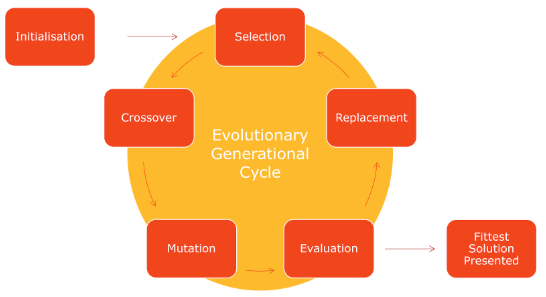
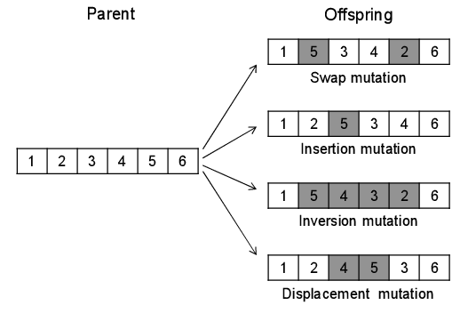

# Technical Overview: SmartScheduling Feature (AP-2566)

## Problem Statement

Cicada schedules jobs across multiple servers. Without optimization, jobs naturally cluster at the same start times (e.g., many cron jobs at :00 or :30 every hour), causing resource spikes and conflicts. Jobs compete for CPU, I/O, and network bandwidth, reducing overall system efficiency and reliability.

## Solution Overview

**SmartScheduling** uses a Genetic Algorithm (GA) to automatically shift job start times, distributing them across the 24-hour period while respecting original cron frequencies and maintaining schedule validity. This reduces peak resource contention and improves system throughput.

The GA evolves shift offsets for each schedule over multiple generations to find near-optimal start time distributions that minimize peak CPU load.

## Architecture

### Core Components

1. **Domain Layer** (`domain.py`) — Represents schedules as Schedule objects

2. **GA Configuration** (`config.py`) — Hyperparameters for optimization

3. **Genetic Algorithm Engine** (`pygad.py`) — PyGAD-based optimizer

4. **Fitness Evaluation** (`evaluation.py`) — Scoring logic

5. **Command Handler** (`smart_schedule.py`) — Orchestrates optimization

6. **Rollback System** (`smart_schedule_rollback.py`) — Recovery mechanism

### Database Schema Changes

**New Tables:**

- **`schedule_backups`** — Audit trail of schedule modifications
  - `schedule_id` (PK): unique identifier
  - `original_interval_mask`: pristine cron expression (before any optimization)
  - `previous_interval_mask`: cron before this optimization run
  - `interval_mask`: current cron after optimization
  - `snapshot_at`: timestamp of last update (auto-set on INSERT/UPDATE)
  - Indexes on `schedule_id` and `server_id` for fast lookups

- **`schedule_blocklist`** — Excludes schedules from optimization
  - `schedule_id` (PK): schedule to exclude
  - `reason`: free-text explanation (e.g., "manual request", "irregular cron")
  - Allows selective opt-out without deleting schedule


## Data Flow

### Optimization Workflow

```
1. Load Schedules
   └─> Query database for all schedules on a server

2. Create schedule Objects per schedule_id
   └─> Calculating properties based on cron schedule
   └─> Check whether it's supported (blocklist, irregular etc.)

3. Run GA Optimization
   └─> GAPyGADScheduler.solve(schedules):
       ├─> Build gene_space (permissible shifts per schedule)
       │   ├─> Unsupported schedules: gene_space = [0] (no shift)
       │   ├─> Frequent schedules (< 60 min): gene_space = [0..frequency)
       │   └─> Infrequent schedules (> 60 min): gene_space = [0..60)
       ├─> Initialize population with current solution as seed
       ├─> PyGAD evolves population over N generations
       │   └─> Each generation: mutation, crossover, fitness evaluation
       ├─> Calculate fitness (-peak_cpu) for each candidate
       └─> Returns best solution

4. Evaluate Improvement
   └─> Compare initial_peak_cpu vs optimized_peak_cpu. If improved: proceed to assignment

5. Update Schedules
   └─> both schedule table and schedule_backups in case of rollback
```

### Rollback Workflow

```
Rollback command triggered with server_id or schedule_id

1. Query schedule_backups for affected schedules
2. Restore to previous interval_mask (or original if full=True)
3. Update schedules table
4. Update schedule_backups with new checkpoint
```

## Genetic Algorithm Details

<p align="center">
  
</p>


### Gene Representation

Each gene is a minute representing where a schedule should start within a day.
- Gene value can take any value between the min and max start time
- The gene space is limited to the smallest range it could be and then extrapolated out when it comes to evaluating the max cpu
- Defining unique gene spaces where each schedule has it's own gene space allows us to reduce the search space considerably. 
- By tailoring our gene spaces we can allow the schedule to only traverse a couple of discrete positions, this makes our algorithm run as efficiently as possible and have a more comprehensive search of the solution space. 


### Fitness Function

Inverse of the peak_cpu since it's a minimisation problem. Peak_cpu is calculated over a single day since that covers 99% of all schedules. 
   - For each schedule, add its cpu_max to the usage array from `start_time` to `start_time + runtime`
   - Repeat for minute
   - Use a difference array for efficient cumulative calculation
   - Uses only the maximum CPU usage across entire day


### Crossover & Mutation

<p align="center">
  
</p>


- **Crossover Type**: Uniform (each gene inherited from random parent per individual)
- **Mutation Type**: Random (randomly select genes and replace with random value from gene space)
- **Elitism**: Keep the best solution across generations (default: 1)

The creation of the offsprings uses different methods to change the solutions, however they must remain within the gene limits. For more information checkout the official [PyGAD documentation](https://pypi.org/project/pygad/5.3.0/) as it will be infinitely better than anything I can produce

### Population Seeding

We seed the initial population with the current solution as we want to **prioritise stability over minor gains**. 
The system is already quite imprecise:
   - assumes uniform CPU usage across all schedules
   - rounds runtime to nearest minute
   - assumes consistent runtimes from one schedule run to another

Because of this imprecision and a natural desire not to overfit the system (e.g. we don't want a solution that minimises the peak cpu unless a heavy schedule runs a minute longer than usual and then it clashes with another heavy schedule) we want to only change the schedule runs when it offers an actual advantage. Shifting schedules occassionally is needed to minimise the cpu usage, however shifting can also cause missed schedule runs (if we e.g. change schedule 13-59/15 * * * * to 9-59/15 * * * * at 11 minutes past the hour).

## Configuration

The `GAConfig` dataclass controls GA behavior. 

Tuning Considerations:
- ↑ `num_generations`: Better solutions but slower
- ↑ `sol_per_pop`: Larger search space but slower
- ↑ `mutation_percent_genes`: More exploration, less exploitation

## Schedule Validation & Filtering

Not all schedules are suitable for GA optimization:

### Supported Schedules
- **Frequency**: `x > 1` & `x <=1440` minutes (1 minute to 1 day)
- **Regularity**: Cron expression must be perfectly regular (same interval between every consecutive run)
- **blocklist**: Schedule is not in `schedule_blocklist` table

### Unsupported Schedules (Skipped)
- **Irregular cron**: e.g., "0 0,12 * * *" (runs at two different times) — frequency varies
- **Too frequent**: <= 1 minute
- **Too rare**: > 1440 minutes (more than a day)
- **blocklisted**: Explicitly marked in `schedule_blocklist` table
- **Parsing errors**: Invalid cron expressions

**Unsupported schedules remain in the fitness evaluation** but don't participate in the optimization (shift = 0 fixed), ensuring the fitness score reflects realistic daily load.


## Checkpointing & Rollback

Every optimization run creates a checkpoint in `schedule_backups`:

- **Original**: pristine pre-optimization cron (set once, never changes unless the schedule gets upserted)
- **Previous**: cron before this optimization
- **Current**: new cron after optimization

**Rollback Options:**
- `--full`: Revert to original (wipe all optimization history)
- (default): Revert to previous (undo last optimization only)

**Selective Rollback:**
- `--server_id`: Rollback all schedules on a server
- `--schedule_id`: Rollback a single schedule

## Integration Points

### CLI Entry Points

Added to `cicada/cli.py`:
- `cicada smart_schedule [--server_id <id>]` — Run optimization
- `cicada smart_schedule_rollback [--server_id <id> | --schedule_id <id>] [--full]` — Revert changes

### Command-Line Parameters for `smart_schedule`

- `--server_id`: Optimize schedules on specific server (optional; all servers if omitted)
- `--dbname`: Database name override
- GA hyperparameters can be passed via `ga_config` parameter (advanced use)

### Database Dependencies

- **Read**: `schedules`, `servers`, `schedule_logs`, `schedule_blocklist`
- **Write**: `schedules` (interval_mask), `schedule_backups` (checkpoints)
- **Functions**: `set_snapshot_at()` trigger

## Design Decisions

### Why a Genetic Algorithm?

1. **NP-hard problem**: Optimal schedule assignment is combinatorially hard; GA provides good approximations in reasonable time
2. **Flexible constraints**: GA naturally handles irregular constraints (blocklists, unsupported frequencies). It allows us an easy mechanism to include these in the calculations while not changing them
3. **No gradient**: Fitness landscape is non-smooth; gradient-free methods suit this
4. **Mature libraries**: PyGAD is well-maintained and configurable
5. **Discrete Runs**: Works well with discrete times


### Why Seed with Current Solution?

- Biases the GA towards an existing solution space (there are many solutions that are equally good and we don't need to explore every single one, this isn't a problem with a clear global minimum)
- Biases search toward improvements on the current baseline which avoids "thrashing" between very different schedules 

### Why Unsupported schedules Stay in Fitness?

- Ensures fitness reflects real daily load (including irregular jobs, blocklisted, etc.)
- Allows GA to account for load from non-optimizable schedules
- Prevents GA from misoptimizing around missing jobs

### Why No Frequency Constraints in Fitness?

- GA gene space enforces frequency constraints (each schedule's shifts are within its frequency)
- Fitness function only evaluates peak, not constraint satisfaction
- Simpler, faster fitness evaluation without redundant checking

## Performance Considerations

- **Time Complexity**: O(pop_size × num_generations × num_schedules × blocks_per_day)
- **Space Complexity**: O(num_schedules × blocks_per_day)
- **Typical Runtime**: ~5-30 seconds for 100-500 schedules, 20 generations, 40 population size
- **Bottleneck**: Fitness evaluation (diff array accumulation); PyGAD overhead minimal

**Optimization Tips:**
- blocklist irregular/infrequent schedules to reduce optimization scope
- Reduce `num_generations` or `sol_per_pop` for faster, lower-quality results (specifically for when testing)

## Future Enhancements

 **CPU**: Add CPU to the model. Needs a separate mechanism to capture CPU levels so this is likely not worthwhile implementing
